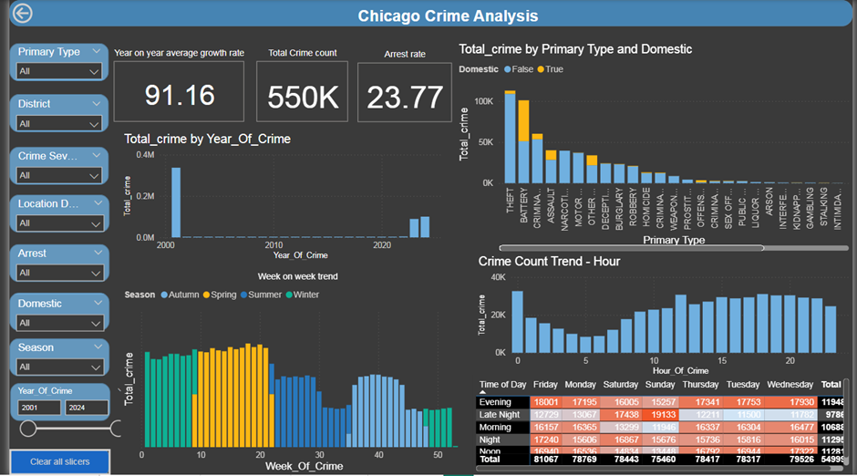
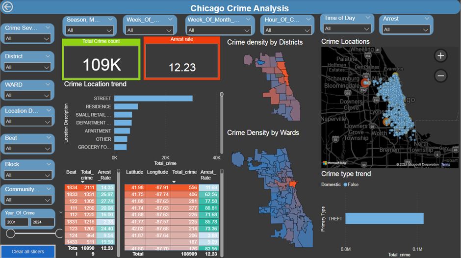

# Chicago Crime Analysis

The increasing complexity of crime data poses challenges for law enforcement and policymakers. This project focuses on analyzing crime data to:

* Identify high-risk locations
* Analyze crime trends and patterns
* Improve resource allocation and enhance public safety

**Objective:** Uncover actionable insights from the dataset to aid in crime prevention and foster safer communities.

**Dataset:** The dataset used for this analysis includes:

* Crime records from Chicago
* Columns: Date, Location, Primary Type, Arrest, etc.

**Work Done:**

* **Data Preprocessing:** 
    1. Imported raw data and performed spell-check on key columns. 
    2. Transformed date and time fields into multiple temporal components. 
    3. Corrected misspelled and duplicate entries using rapidfuzz. 
    4. Consolidated block names and geocoded unique locations. 
    5. Exported cleaned data as "Updated_crime_block_No_null.xlsx".
* **Location Data Enrichment:** 
    1. Used geopy for geocoding block names. 
    2. Extracted ward, district, and community area using shapefiles. 
    3. Final dataset saved as "Location_updated.xlsx".
* **Visualization:** 
    1. Imported data into Power BI with a star schema. 
    2. Created metrics using DAX formulas: Total Crime Count, Arrest Rate, Safety Score. 
    3. Developed dashboards for: Crime Hotspots, Crime Trends, Safety Assessments. 
    4. Used TopoJSON for filled maps.

**Key Insights:** 

* Identified crime hotspots and peak hours.
* Evaluated arrest efficiency by location.
* Provided safety scores for neighborhoods.
* Predicted future crime trends for proactive measures.

**Tools Used:**

* Python: pandas, geopandas, rapidfuzz, geopy
* Power BI: Dashboards and visualizations
* QGIS: Shapefile processing
* GeoJson.io and Mapshaper: GeoJSON and TopoJSON conversion

**How to Use:**

1. Clone the repository:
git clone https://github.com/Aravind-M2/Chicago-Crime-Analysis.git
2. Install required Python libraries:
pip install pandas geopandas geopy rapidfuzz

3. Open the Jupyter notebooks for data cleaning and preprocessing.
4. Load the Power BI file for visualizations.

**Future Scope:**

* Integration with live crime data
* Enhanced predictive modeling
* Real-time safety alerts

**Dashboards**

**Open the PowerBI file to access the full dashboards**

**online Slides**
https://gamma.app/docs/Chicago-Crime-Analysis-1gvi1kgrh246jo9

